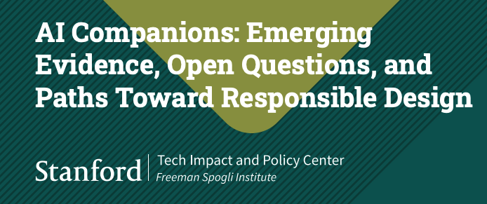

# GPT - Qwen 翻訳ベンチ

## 対象とした論文

[AIコンパニオン：新たな証拠、未解決の課題、そして責任ある設計への道筋](https://fsi.stanford.edu/publication/ai-companions-emerging-evidence-open-questions-and-paths-toward-responsible-design)
発行：2026年9月15日

48ページの英語報告書を日本語に翻訳した成果物と、その原文照合レビュー。

## 成果物

- **GPT-6 Astra（GPT-6 Lunaサブエージェント）**：[翻訳全文](translation_GPT.md)｜[レビュー](gpt.md)
- **Qwen-3.8-27B**：[レビュー](qwen.md)｜分割訳 [1](translation_chunk1.md)・[2](translation_chunk2.md)・[3](translation_chunk3.md)・[4](translation_chunk4.md)・[5](translation_chunk5.md)・[6](translation_chunk6.md)・[7](translation_chunk7.md)

## 結果と所感

- **GPT系**は表の引用対応や図の数値を概ね保持し、日本語も比較的読みやすい。一方、「身体的な同席」「幻覚」など、意味の幅や分野の慣用に合わない訳語と用語の揺れが残る。
- **Qwen系**は中国語の混入（「围绕う」86件）、表3の引用対応のずれ、表4のセルを「（同上）」で省いた箇所（22件）が目立つ。分割訳の継ぎ目や参考文献の途中終了も確認できる。

長文翻訳では、文章の自然さに加えて、図表・引用・参考文献を最後まで保持できたかが大きな差になる。ここでの比較は成果物と同梱レビューに基づく品質評価であり、速度や費用は比較していない。
