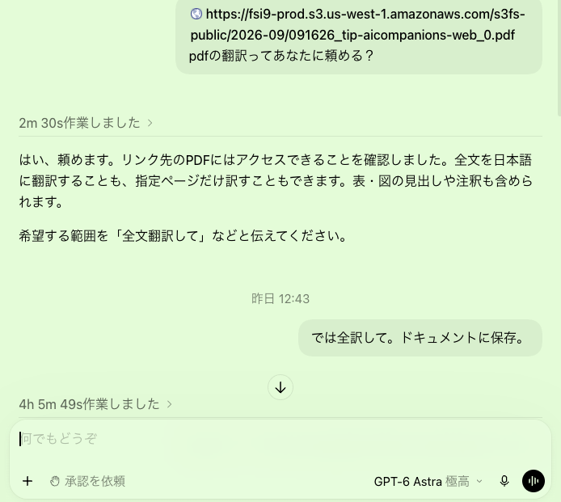

# GPT-6 Astra（GPT-6 Luna）翻訳レビュー

## 使用したプロンプト

## 総評

GPT-6 Astra(6 Luna) は Qwen-3.8-27B より全体の精度は高い（表の引用対応も概ね原文どおり）。

一方で、「身体的な同席」のように、英単語の直訳・狭い語への置き換え・分野用語の誤読を招く訳が散見されます。

以下は、英語原文と照合して拾った、意味がずれやすい／伝わりにくい箇所です。

## 意味がずれる・誤解を招きやすい箇所（重要度順）

### 1. physical presence

**原文（Table 1 / Emotional attunement）**

> … without resolving users’ need for human connection or physical presence.

**今回の訳**

> 人間とのつながりや身体的な同席へのニーズを解決しない

**問題**

physical presence は「（人が）実際にそばにいること／身体を伴う存在」です。

日本語の「同席」は会議・食事などに一緒に座ることのニュアンスが強く、原文とニュアンスが異なります。

**より近い訳の例**

「身体的な存在」「実際にそばにいること」「対面でそばにいること」

### 2. Hallucinations

**原文（Figure 3）**

> 非人間的課題の一つとして Hallucinations

**今回の訳**

> 「幻覚」

**問題**

ここは精神医学の幻覚ではなく、LLMの ハルシネーション（事実でない生成） です。「幻覚」だと臨床的な意味に読まれます。

**より近い訳の例**

「ハルシネーション（事実にない出力）」「虚偽の生成」

### 3. behaviour friction

**原文**

> What responsibility mechanisms work best: behaviour friction, technical constraints, or policy governance?

本文では cooldown / usage reminders / time limits など、利用行動に摩擦を入れる手法です。

**今回の訳（見出し）**

> 「行動への抵抗を促す仕組み、技術的制約、政策ガバナンス…」

**問題**

本文の具体例は正しい一方、見出しだけ読むと「抵抗運動を促す」ようにも読め、UX安全策の friction（わざと使いづらくする）からずれます。

**より近い訳の例**

「行動に摩擦を入れる仕組み」「利用行動へのフリクション（クールダウン等）」

### 4. companionship / sense of companionship

**原文**

> emotional support, companionship, mentorship…
>
> … emotional support, and a sense of companionship.

**今回の訳**

> 「感情的支援、交友、メンタリング…」
>
> 「交友の感覚を提供する」

**問題**

companionship は友情（friendship）に限らず、「伴っている感じ」全般です。原文自身が “Companion” は human friendship を連想させすぎると注意しているのに、訳で「交友」に寄せると論旨とぶつかることがあります。文書内では「コンパニオンシップ」も併用されており、用語が揺れています。

**より近い訳の例**

「コンパニオンシップ（伴走感）」「そばにいる感覚」（初出で括弧説明）

> **追記：** 日本語にジャストな用語がなく、翻訳困難。
>
> 「職業的話し相手」らしいのですが、いわゆる付人や食客ではない。

### 5. affective mirroring

**原文**

> Core companion attributes, such as affective mirroring, constant availability…

**今回の訳**

> 「感情の反映、常時利用可能であること…」

**問題**

「反映」は reflection（内省・反映）にも読め、ミラーリング（感情の映し返し） という技術・臨床用語からずれやすいです。

**より近い訳の例**

「感情のミラーリング」「感情の映し返し」

> **追記：** 人間側の感覚としては「感情の共有」近いけど、技術的にはミラーリング。

### 6. guided redirection

**原文**

> … more nuanced approaches such as de-escalation or guided redirection.

**今回の訳**

> 「緊張緩和や段階的な誘導など」

**問題**

redirection は支援先・安全な話題などへ向き先を変えること。「段階的な誘導」だと、一般的なナッジ／説得にも読めます。

**より近い訳の例**

「誘導的なリダイレクト」「（支援・安全な話題への）段階的な indirection／ indirection 」→ 実務的には「段階的に支援へつなぐこと」

> **追記：** これは段階的な誘導でいいと思います。

### 7. non-social

**原文**

> social versus non-social companion use cases

**今回の訳**

> 「社会的な用途と非社会的な用途」

**問題**

日本語の「非社会的」は「反社会的」に隣接して読まれやすい。原文は タスク志向／対人関係を主目的としない 用途です。

**より近い訳の例**

「対人関係を主としない用途」「非対人的（タスク志向）な用途」

### 8. soft off-ramps

**原文**

> crisis detection, graduated interventions, soft off-ramps, and referral pathways…

**今回の訳**

> 「危機の検知、段階的な介入、穏やかな離脱手段、…紹介経路」

**問題**

大きくは合っていますが、off-ramp は「激しい関与・依存から降りるための出口設計」です。「穏やかな離脱」だけだと、単にソフトな切断にも読めます。

**より近い訳の例**

「ソフトな出口（オフランプ）」「急がなく依存から降りられる仕組み」

> **追記：** これも難しい「依存からの緩やかな脱出経路」とかかなあ

### 9. simulationship

**原文**

> socio-affective agent, guide, coach, or simulationship

**今回の訳**

> 「社会情動的エージェント、ガイド、コーチ、シミュレーションシップ」

**問題**

音写は正しいが、造語（simulation + -ship）の意味が伝わりません。説明なしだと死語化します。

**より近い訳の例**

「シミュレーションシップ（模擬的な関係性）」

### 10. propensity to engender protectiveness

**原文**

> 否定的設計要素の一つとして、利用者が（AIを）守りたくなる性質を生むこと。

**今回の訳**

> 「利用者に相手を守ろうとする気持ちを起こさせやすい」

**問題**

方向性は合っていますが、「相手」が誰か（AIか他者か）が曖昧です。

**より近い訳の例**

「利用者に、AIコンパニオンを守りたい気持ちを起こさせやすいこと」

## 伝わりにくいが、大きくは外していない箇所

| 英語 | 今回の訳 | コメント |
| --- | --- | --- |
| relational humility | 関係性における謙虚さ | 直訳調。初出で「人間関係と比べ自らの限界を認める設計」と補足するとよい |
| socially present | 社会的にその場にいるようで | social presence の直訳。表では「社会的な存在感」と別訳あり、揺れ |
| flourishing | 「充実」と「フローリッシング」が混在 | 文書内で統一されていない（充実×8、フローリッシング×3） |
| social rehearsal | 「社会的なリハーサル」と「予行演習」が混在 | 同じ概念の訳ゆれ |
| validation（感情） | 「肯定」 | unconditional affirmation の「肯定」と区別しにくい。承認／受け止める の方が安全な場合あり |
| illusion of companionship（Putnam） | 「仲間がいるという幻想」 | 大意は可。引用としては「コンパニオンシップの幻想」の方が原文に近い |
| product sunsetting | 「製品の提供終了」 | 意味は通る。プロダクト終了・サービス終了のニュアンス |
| autonomy-affirmation | 「自律性を支える働きかけ」 | 大意は可。affirmation（肯定・支援）の語感は弱まる |

## 良かった点

- Table 3 の引用対応は原文と整合（Qwen 3.8 27B のような行ずれ・「研究なし」化はない）
- 围绕う / 高风险 のような中国語混入はない
- paternalism → パターナリズム、attachment hacking → 愛着ハッキング など、分野語の選択は概ね妥当

## 改善点の整理

GPT-6 Astra(6 Luna) の弱点は「誤訳の多さ」より、

1. 語の射程が狭い／ずれる（同席、交友、非社会的、幻覚）
2. 専門スラングの直訳で不透明（行動への抵抗、感情の反映、シミュレーションシップ）
3. 同一概念の訳ゆれ（充実／フローリッシング、リハーサル／予行演習）

[ベンチ一覧に戻る](README.md) · [翻訳全文を読む](translation_GPT.md)
