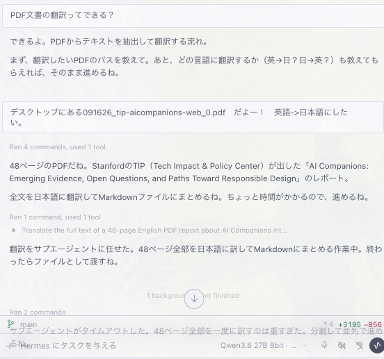

# Qwen-3.8-27B 翻訳レビュー

## 使用したプロンプト

## 総評

Qwen-3.8-27B は、意味の骨格は取れている一方で、GPT-6 Astra ( SubAgent GPT-6 Luna)より明らかに劣る。主な差は次の３点です。

1. 中国語簡体の混入
2. 表・レイアウト失敗
3. 日本語として不自然／分野慣習から外れる

GPT Astraは同じ原文に対して、自然な日本語・用語統一・表の扱いが安定しています。

## 照合の前提

| 系統 | ファイル | 役割 |
| --- | --- | --- |
| 原文 | `091626_tip-aicompanions-web_0.pdf` | 親（英） |
| 邦訳A：Qwen-3.8-27B | `translation_chunk1.md〜7.md` | チャンク分割訳 |
| 邦訳B：GPT-6 Astra（GPT-6 Luna） | `AI_Companions_全文日本語訳.docx`（[Markdown版](translation_GPT.md)） | 一文書の完成度が高い訳 |

分量の目安：Qwen-3.8-27B 本文 約6.1万字、GPT-6 Astra (6 Luna) 約7.8万字。Qwen-3.8-27Bの方が短く、表の中身欠落と図の数値展開の薄さが効いています。

## 1. 中国語の混入（Qwen-3.8-27B固有）

| 出現 | 回数 | 問題 | GPT-6 Astra (6 Luna)側の例 |
| --- | --- | --- | --- |
| 围绕う | 86 | 中 围绕 ＋ 日 う の合成語 | をめぐる / についての |
| 高风险 | 5 | 簡体字 风险 | 高リスク / リスクの高い |
| 那些 | 1 | 中国語指示詞 | それらの |
| 亲密さ | 1 | 簡体 亲密 | 親密さ |
| 效果 | 1 | 中字形（日は 効果） | 効果 |

例：

- Qwen-3.8-27B: 「AIコンパニオン围绕うワークショップの議論」
- GPT-6 Astra (6 Luna): 「定義をめぐる問い」

围绕うが86回は、語彙置換やポストエディットではなく、中国語経由／中国語混在モデル出力がそのまま残ったパターンに近い。

## 2. 表の対応ずれと欠落

### 表3：害と関連研究の引用ずれ

PDFの対応関係（要旨）と Qwen-3.8-27B の表が食い違います。

| 行 | PDF上の関連研究（要旨） | Qwen-3.8-27B の表 |
| --- | --- | --- |
| 3 Deskilling | Hajek et al. | Zimmerman & Ruiz; Ho …（本来は4行目側） |
| 4 Erotic role-play | Zimmerman & Ruiz; Ho; De Freitas | De Freitas×2; Andersson |
| 5 Manipulation | De Freitas | Eklund; Sourati; Tao |
| 6 Spillover | Andersson; Eklund | Poonsiriwong のみ |
| 7 Homogenization | Sourati; Poonsiriwong; Tao | （研究なし） ← 原文に研究あり |

典型的な 2段組PDF／複数カラム表の列ずれです。研究マッピングとしては事実誤りになります。

### 表4：分野横断の責任のセル欠落

Qwen-3.8-27Bは多くのセルを （同上）（22回） で潰しています。ガバナンス表として機能しません。GPT-6 Astra (6 Luna)側は行ごとに中身を保持（または続きとして展開）しています。

## 3. 未訳の英語が本文に残留

Qwen-3.8-27B本文に英語がそのまま残っています。

- modest（「効果は一般的に modest」）
- emotionally intensive（「情緒的に intensive」）
- poorly understood（「依然として poorly understood」）
- チャンク末付近: ノート-taking、プロフラワーリング（pro-flourishing の無理な音写）

GPT-6 Astra (6 Luna)は同箇所を日本語化しています（例: 「概して小さく」「感情をくみ取る」「十分に理解されていない」「人間の充実を促す」）。

## 4. 訳語・文体の差（間違いというより品質差）

同じ概念でも、Qwen-3.8-27Bは英語構文の直訳＋カタカナ学術語、GPT-6 Astra (6 Luna)は日本語レポートとして通る語に寄っています。

| 英語 | Qwen-3.8-27B | GPT-6 Astra (6 Luna)（相対的に良い） |
| --- | --- | --- |
| regarding / around | 〜围绕う | 〜をめぐる |
| supporting research | 支持研究 | 裏付け研究 |
| non-exhaustive | 非包括的 | 網羅的ではない 系 |
| emotionally attuned | 情緒的にチューニング | 感情をくみ取る |
| paternalism | 父権主義 | パターナリズム |
| flourishing | （人間の）繁栄 | 充実 / フローリッシング |
| deskilling | スキル低下 | 能力の低下 |
| attachment hacking | アタッチメント・ハッキング | 愛着ハッキング |
| low-consequence | 低結果の | （結果が軽い／失敗コストの低い、等） |
| scaffold (v.) | スキャフォールドする | 言い換え（支える／段階的に育てる） |
| downstream effects | 下流効果 | 下流への影響 等 |
| marginalized | 周辺化された | 文脈に応じて自然化 |

また Qwen-3.8-27B には重複ノイズもあります（例: 「新たな心理的、社会的、社会的リスク」）。

## 5. チャンク分割由来の欠陥

translation_chunk4 / 5 は文の途中で切れている。

- chunk4末: 「運用上も」で途切れ
- chunk5末: 「より広範な問いを」で途切れ
- chunk6: ノート-taking のような混在

チャンク結合時の再読・継ぎ目校正が弱いと、切れ目の文が永久に壊れます。

図6・7も、GPT-6 Astra (6 Luna)は内訳（74% / 66% 等）を明示、Qwen-3.8-27Bは要約数値中心で図表の情報密度が低いです。

[ベンチ一覧に戻る](README.md)
